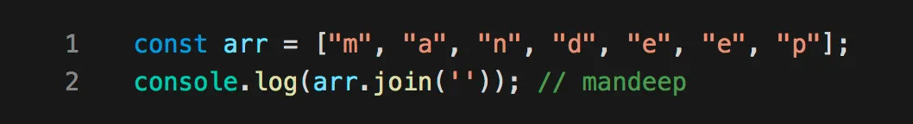
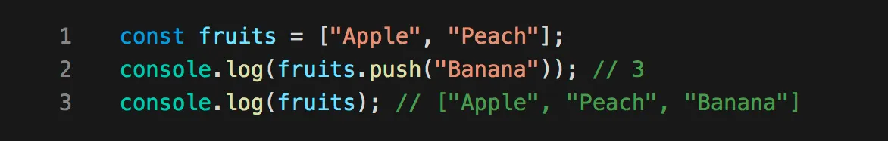

# Primitive and Non-primitive Data Types in JavaScript

JavaScript has two types of data types: primitive and non-primitive.

## Primitive Data Types

Primitive data types are the predefined data types provided by the JavaScript language. They are also known as in-built data types. The primitive data types in JavaScript are:

1. **Number**: The number data type in JavaScript can hold both decimal and non-decimal values.

```javascript
let x = 250;
let y = 40.5;
console.log("Value of x=" + x);
console.log("Value of y=" + y);
```

2. **String**: The string data type in JavaScript represents a sequence of characters enclosed in single or double quotes.

```javascript
let str = 'Hello All';
let str1 = "Welcome to my new house";
console.log("Value of str=" + str);
console.log("Value of str1=" + str1);
```

3. **Undefined**: The undefined data type signifies that a value is not assigned to a variable.

4. **Boolean**: The boolean data type can have only two values: true and false.

5. **Null**: The null data type can hold only one value, which is null.

```javascript
let x = null;
console.log("Value of x=" + x);
```

6. **BigInt**: The bigint data type can represent numbers greater than 2^53-1 and is used for performing operations on large numbers. The number is specified by appending 'n' to the end of the value.

```javascript
let bigNum = 123422222222222222222222222222222222222n;
console.log(bigNum);
```

7. **Symbol**: The symbol data type is used to create unique objects. Symbols are created using the Symbol constructor.

```javascript
let sym = Symbol("Hello");
console.log(typeof(sym));
console.log(sym);
```

## Non-primitive Data Types

Non-primitive data types are derived from primitive data types in JavaScript. They are also known as derived or reference data types. The non-primitive data types in JavaScript are:

1. **Object**: An object in JavaScript is an entity that has properties and methods. In JavaScript, everything is an object.

2. **Array**: JavaScript arrays are used to store elements of different data types. Arrays are zero-indexed, and they are not associative in nature.

## Array in JS
### Creating an array 

```javascript
// Creating an array using array literal:
let courses = ["HTML", "CSS", "JavaScript", "React"];
console.log(courses);

// Creating an array using the new keyword:
let arr1 = new Array(3);
arr1[0] = 10;
arr1[1] = 20;
arr1[2] = 30;
console.log("Array 1: ", arr1);

let arr2 = new Array(10, 20, 30, 40, 50);
console.log("Array 2: ", arr2);

let arr3 = new Array(5);
console.log("Array 3: ", arr3);

let arr4 = new Array("1BHK");
console.log("Array 4: ", arr4);
```

### Accessing Elements of an Array
Any element in the array can be accessed using the index number. The index in the arrays starts with 0.
```javascript
const courses = ["HTML", "CSS", "Javascript"];
console.log(courses[0])
console.log(courses[1])
console.log(courses[2])


HTML
CSS
Javascript
```

### Convert an Array to String
```javascript
const courses = ["HTML", "CSS", "Javascript"];
console.log(courses.toString())
//HTML,CSS,Javascript
```
### Loop through Javascript Array Elements
```javascript
const courses = ["HTML", "CSS", "Javascript"];
for (let i = 0; i < courses.length; i++) {
	console.log(courses[i])
}


HTML
CSS
Javascript
```
### Adding new elements to JavaScript Array
```javascript
const courses = ["HTML", "CSS", "Javascript"];
console.log("Original Array: ",courses)
courses.push("React")
console.log("Array after adding an element: ",courses)


Output
Original Array:  [ 'HTML', 'CSS', 'Javascript' ]
Array after adding an element:  [ 'HTML', 'CSS', 'Javascript', 'React' ]
```
* We can also add a new element to a Javascript array using the length property.
```javascript
const courses = ["HTML", "CSS", "Javascript"];
console.log("Original Array: ",courses)
courses[courses.length] = "React"
console.log("Array after adding an element: ",courses)


Original Array:  [ 'HTML', 'CSS', 'Javascript' ]
Array after adding an element:  [ 'HTML', 'CSS', 'Javascript', 'React' ]
```
### Difference between Javascript arrays and objects
In JavaScript, arrays use numbered indexes and objects use named indexes.


## JavaScript Array Methods
1. map( )
   This method creates a new array with the results of calling a provided function on every element in this array.<br/>
    

2. filter( )
   This method creates a new array with only elements that passes the condition inside the provided function.<br/>
   

3. sort( )
   This method is used to arrange/sort array’s elements either in ascending or descending order.<br/>
   

4. forEach( )
   This method helps to loop over array by executing a provided callback function for each element in an array.<br/>
   
5. concat( )
   This method is used to merge two or more arrays and returns a new array, without changing the existing arrays.<br/>
   

6. every( )
   This method checks every element in the array that passes the condition, returning true or false as appropriate.<br/>
   

7. some( )
   This method checks if at least one element in the array that passes the condition, returning true or false as appropriate.<br/>
   

8. includes( )
   This method checks if an array includes the element that passes the condition, returning true or false as appropriate.<br/>
   

9. join( )
   This method returns a new string by concatenating all of the array’s elements separated by the specified separator.<br/>
   

10. reduce( )
    This method applies a function against an accumulator and each element in the array to reduce it to a single value.<br/>
    

11. find( )
    This method returns the value of the first element in an array that pass the test in a testing function.<br/>
    

12. findIndex( )
    This method returns the index of the first element in an array that pass the test in a testing function.<br/>
    

13. indexOf( )
    This method returns the index of the first occurrence of the specified element in the array, or -1 if it is not found.<br/>
    

14. slice( )
    This method returns a new array with specified start to end elements.

  
15. reverse( )
    This method reverses an array in place. Element at last index will be first and element at 0 index will be last.
    

16. push( )
    This method adds one or more elements to the end of array and returns the new length of the array.
  
17. pop( )
    This method removes the last element from the end of array and returns that element.
    

18. shift( )
    This method removes the first element from an array and returns that element.
    

19. unshift( )
    This method adds one or more elements to the beginning of an array and returns the new length of the array.
    


### Difference between Primitive and Non-primitive Data Types:

| Primitive                | Non-Primitive             |
|--------------------------|---------------------------|
| Predefined data types    | Created by the programmer |
| Has certain values       | Can be null               |
| Size depends on the data structure | Size is not fixed |
| Examples: numbers, strings | Examples: objects, arrays |

## Objects

Objects in JavaScript are entities that have properties and methods. There are multiple ways to create objects in JavaScript:

1. Object literal


```javascript
const firstObj = {
  1: "deepak",
  "age": 28
};
```

2. Object.create(): This method creates a new object with the specified prototype and properties of the old object.

```javascript
const newStudent = Object.create(student);
```

3. Object Instance: The use of Object constructor in conjunction with the "new" keyword allows us to initialize new objects.

```javascript
const newObj = new Object();
newObj.name = 'Deepak';
newObj.location = 'Delhi, India';
```

### Adding, Updating, and Removing Properties of an Object

Properties can be added to an object using dot notation or bracket notation.

```javascript
const a = {};
a.name = 'deepak';
a['city'] = 'delhi';
a[1] = 'dope';
```

To iterate over the properties of an object, you can use loops like for...in and for...of loops.

```javascript
for (const key in a) {
   console.log(key, a[key]);
}
```
Note we need to do a[key] to access value if i write a.key then it will `undefined`

## How to Get the Length of an Object in JavaScript?
```javascript
Object.keys(exampleObject).length
```

```javascript
var obj = {
  Name: "Muthu",
  PhoneNo: "8794561234",
  age: 15 
};
// Here we are getting the object length
var length = Object.keys(obj).length;
console.log(length);  // 3
```

or
```javascript
Object.values(obj).length
```

```javascript
// A Sample object is created here
var obj = {
    Name: "Rakesh",
    PhoneNo: 7546899871,
    age: 18
};
// Here we are getting the object length
var length = Object.values(obj).length;
console.log(length); // 3
```

or 
```javascript
Object.entries(obj).length
```
```javascript
// A Sample object is created here
var obj = {
    Name: "Nanda",
    PhoneNo: 9876541237,
    age: 18 
};
// Here we are Getting the object length
var length = Object.values(obj).length;
console.log(length);

```


## Shallow Copy and Deep Copy in JavaScript

In JavaScript, there are two ways to copy objects: shallow copy and deep copy.

### Shallow Copy

A shallow copy creates a new object, but any nested objects or arrays within the original object still reference the same memory location. Changes to the nested objects will affect both the original and copied objects. Here's an example of shallow copying using the spread operator:

```javascript
// Original object
const original = { name: "John", age: 25 };

// Shallow copy
const shallowCopy = original;

// Modifying the copied object
shallowCopy.age = 30;

console.log(original);     // Output: { name: "John", age: 30 }
console.log(shallowCopy);  // Output: { name: "John", age: 30 }
```

### Deep Copy

A deep copy creates a new object with new memory locations for all properties and nested objects or arrays. Changes made to the copied object or its nested objects will not affect the original object. Here's an example of deep copying using JSON methods:

```javascript
const original = { name: "John", age: 25 };

// Deep copy
const deepCopy = JSON.parse(JSON.stringify(original));

// Modifying the copied object
deepCopy.age = 30;

console.log(original);  // Output: { name: "John", age: 25 }
console.log(deepCopy);  // Output: { name: "John", age: 30 }
```

## Spread Operator

The spread operator `...` is used to expand or spread an iterable or an array. It can be used to copy items into a single array or to clone arrays and objects. Examples:

```javascript
const arrValue = ['My', 'name', 'is', 'Jack'];
console.log(arrValue);   // ["My", "name", "is", "Jack"]
console.log(...arrValue); // My name is Jack

const arr1 = ['one', 'two'];
const arr2 = [...arr1, 'three', 'four', 'five'];
console.log(arr2);
// Output: ["one", "two", "three", "four", "five"]
```

To clone an array using the spread operator:

```javascript
let arr1 = [1, 2, 3];
let arr2 = [...arr1];
```
This will create deep copy.
To clone an object using the spread operator:

```javascript
const obj1 = { x: 1, y: 2 };
const obj2 = { ...obj1 };
console.log(obj2); // output is { x: 1, y: 2 }
obj2.y = 100;
console.log(obj1,obj2); //output is { x: 1, y: 2 } { x: 1, y: 100 }
```

## Rest Parameter

The rest parameter allows a function to accept multiple arguments as an array. It uses the spread operator and is useful when the number of arguments is not known beforehand. Example:

```javascript
let func = function(...args) {
    console.log(args);
}

func(3);            // [3]
func(4, 5, 6);      // [4, 5, 6]
```
# all use cases of spread operator 
1. **Array Manipulation**: 
``` 
// Concatenating arrays
const arr1 = [1, 2, 3];
const arr2 = [4, 5, 6];
const mergedArray = [...arr1, ...arr2];
console.log(mergedArray); // Output: [1, 2, 3, 4, 5, 6]

// Creating a copy of an array
const originalArray = [1, 2, 3];
const newArray = [...originalArray];
console.log(newArray); // Output: [1, 2, 3]

// Adding elements to an existing array
const existingArray = [1, 2, 3];
const updatedArray = [...existingArray, 4, 5];
console.log(updatedArray); // Output: [1, 2, 3, 4, 5]
```
2. **Object Manipulation**:
```
// Creating a copy of an object
const originalObject = { name: 'John', age: 25 };
const newObject = { ...originalObject };
console.log(newObject); // Output: { name: 'John', age: 25 }

// Merging multiple objects into one
const obj1 = { x: 1 };
const obj2 = { y: 2 };
const mergedObject = { ...obj1, ...obj2 };
console.log(mergedObject); // Output: { x: 1, y: 2 }

// Adding properties to an existing object
const existingObject = { name: 'John' };
const updatedObject = { ...existingObject, age: 25 };
console.log(updatedObject); // Output: { name: 'John', age: 25 }
```
3. **Function Arguments**:
```
// Passing an array of arguments to a function
const sum = (a, b, c) => a + b + c;
const numbers = [1, 2, 3];
console.log(sum(...numbers)); // Output: 6
```
4. **Component Props in React**:
```
// Passing props using the spread operator in React
const MyComponent = ({ prop1, prop2, prop3 }) => {
  // Component logic here
};

const props = { prop1: 'value1', prop2: 'value2', prop3: 'value3' };

// Pass props to the component using spread operator
<MyComponent {...props} />;
```
5. **React State Updates**:
```
// Updating state using the spread operator in React
class MyComponent extends React.Component {
  state = {
    name: 'John',
    age: 25,
    address: '123 Street',
  };

  updateState = () => {
    this.setState({
      ...this.state, // Preserve existing state
      age: 26, // Update specific property
    });
  };

  render() {
    // Component rendering logic here
  }
}
```
6. **Array and Object Destructuring**:
```
// Array destructuring with the spread operator
const numbers = [1, 2, 3, 4, 5];
const [first, second, ...rest] = numbers;
console.log(first); // Output: 1
console.log(second); // Output: 2
console.log(rest); // Output: [3, 4, 5]

// Object destructuring with the spread operator
const person = { name: 'John', age: 25, address: '123 Street' };
const { name, ...details } = person;
console.log(name); // Output: 'John'
console.log(details); // Output: { age: 25, address: '123 Street' }
```
# all use cases of rest operator

1. **Function Parameter Packing**:

The rest operator allows you to pack multiple function    arguments into a single array. This can be useful when you want to pass a variable number of arguments to a function.
```
function sum(...numbers) {
  return numbers.reduce((total, num) => total + num, 0);
}

console.log(sum(1, 2, 3)); // 6
console.log(sum(4, 5, 6, 7, 8)); // 30
```
2. **Array Destructuring**:
The rest operator can be used in array destructuring to capture the remaining elements of an array into a new array.
```
const [first, second, ...rest] = [1, 2, 3, 4, 5];

console.log(first); // 1
console.log(second); // 2
console.log(rest); // [3, 4, 5]
```
3. **Object Destructuring**:
Similarly, the rest operator can be used in object destructuring to capture the remaining properties of an object into a new object.
```
const { name, age, ...rest } = { name: 'John', age: 25, city: 'New York', country: 'USA' };

console.log(name); // 'John'
console.log(age); // 25
console.log(rest); // { city: 'New York', country: 'USA' }
```
4. **Function Parameter Unpacking**:
The rest operator can be used to unpack an array and pass its elements as individual arguments to a function.
```
function greet(firstName, lastName) {
  console.log(`Hello, ${firstName} ${lastName}!`);
}

const names = ['John', 'Doe'];
greet(...names); // Hello, John Doe!
```
