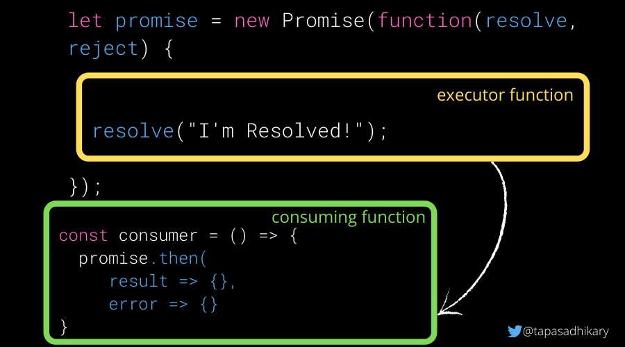
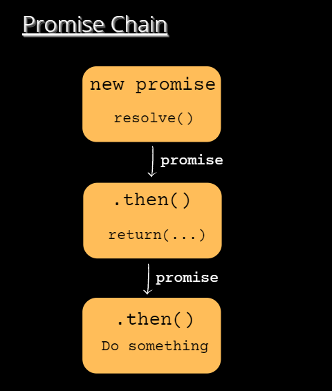
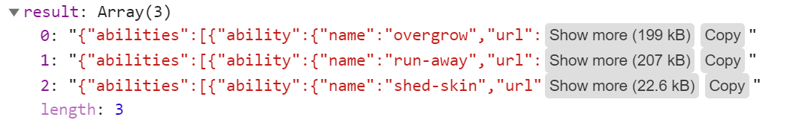

# What is a Promise in JavaScript?
A `Promise` is a special JavaScript object. It produces a value after an asynchronous (aka, async) operation completes successfully, or an error if it does not complete successfully due to time out, network error, and so on.

Successful call completions are indicated by the resolve function call, and errors are indicated by the reject function call.
You can create a promise using the promise constructor like this:

```javascript
let promise = new Promise(function(resolve, reject) {    
    // Make an asynchronous call and either resolve or reject
});

```
## Understanding Promise States
```javascript
let promise = new Promise(function(resolve, reject) {
  // Code to execute
});
```
The constructor function takes a function as an argument. This function is called the executor function.

```javascript
// Executor function passed to the 
// Promise constructor as an argument
function(resolve, reject) {
    // Your logic goes here...
}
```

The executor function takes two arguments, resolve and reject. These are the callbacks provided by the JavaScript language. Your logic goes inside the executor function that runs automatically when a new Promise is created.

A promise object has the following internal properties:

* state – This property can have the following values:
* pending: Initially when the executor function starts the execution.
* fulfilled: When the promise is resolved.
* rejected: When the promise is rejected.

**result** – This property can have the following values:

* undefined: Initially when the state value is pending.
* value: When resolve(value) is called.
* error: When reject(error) is called.

A promise's state can be pending, fulfilled or rejected. A promise that is either resolved or rejected is called settled.

## How promises are resolved and rejected

Here is an example of a promise that will be resolved (fulfilled state) with the value I am done immediately.
```javascript
let promise = new Promise(function(resolve, reject) {
    resolve("I am done");
});
```

The promise below will be rejected (rejected state) with the error message Something is not right!.

```javascript
let promise = new Promise(function(resolve, reject) {
    reject(new Error('Something is not right!'));
});
```

An important point to note:

`A Promise executor should call only one resolve or one reject. Once one state is changed (pending => fulfilled or pending => rejected), that's all. Any further calls to resolve or reject will be ignored.
`
```javascript
let promise = new Promise(function(resolve, reject) {
  resolve("I am surely going to get resolved!");

  reject(new Error('Will this be ignored?')); // ignored
  resolve("Ignored?"); // ignored
});
```

# How to handle a Promise once you've created it
A Promise uses an executor function to complete a task (mostly asynchronously). A consumer function (that uses an outcome of the promise) should get notified when the executor function is done with either resolving (success) or rejecting (error).

The handler methods, .then(), .catch() and .finally(), help to create the link between the executor and the consumer functions so that they can be in sync when a promise resolves or rejects.



##  How to Use the .then() Promise Handler

The .then() method should be called on the promise object to handle a result (resolve) or an error (reject).

It accepts two functions as parameters. Usually, the .then() method should be called from the consumer function where you would like to know the outcome of a promise's execution.

```javascript
promise.then(
  (result) => { 
     console.log(result);
  },
  (error) => { 
     console.log(error);
  }
);
```

If you are interested only in successful outcomes, you can just pass one argument to it, like this:
```javascript
promise.then(
  (result) => { 
      console.log(result);
  }
);
```

If you are interested only in the error outcome, you can pass null for the first argument, like this:

```javascript
promise.then(
  null,
  (error) => { 
      console.log(error)
  }
);
```

**Example 1: Get 50 Pokémon's information:**

```javascript
const ALL_POKEMONS_URL = 'https://pokeapi.co/api/v2/pokemon?limit=50';

// We have discussed this function already!
let promise = getPromise(ALL_POKEMONS_URL);

const consumer = () => {
    promise.then(
        (result) => {
            console.log({result}); // Log the result of 50 Pokemons
        },
        (error) => {
            // As the URL is a valid one, this will not be called.
            console.log('We have encountered an Error!'); // Log an error
    });
}

consumer();
```

## How to Use the .catch() Promise Handler
You can use this handler method to handle errors (rejections) from promises. The syntax of passing null as the first argument to the .then() is not a great way to handle errors. So we have .catch() to do the same job with some neat syntax:

```javascript
// This will reject as the URL is 404
let promise = getPromise(POKEMONS_BAD_URL);

const consumer = () => {
    promise.catch(error => console.log(error));
}

consumer();

```

If we throw an Error like new Error("Something wrong!")  instead of calling the reject from the promise executor and handlers, it will still be treated as a rejection. It means that this will be caught by the .catch handler method.


This is the same for any synchronous exceptions that happen in the promise executor and handler functions.

Here is an example where it will be treated like a reject and the .catch handler method will be called:

```javascript
new Promise((resolve, reject) => {
  throw new Error("Something is wrong!");// No reject call
}).catch((error) => console.log(error)); 

```

## How to Use the .finally() Promise Handler
The .finally() handler performs cleanups like stopping a loader, closing a live connection, and so on. The finally() method will be called irrespective of whether a promise resolves or rejects. It passes through the result or error to the next handler which can call a .then() or .catch() again.

```javascript
let loading = true;
loading && console.log('Loading...');

// Gatting Promise
promise = getPromise(ALL_POKEMONS_URL);

promise.finally(() => {
    loading = false;
    console.log(`Promise Settled and loading is ${loading}`);
}).then((result) => {
    console.log({result});
}).catch((error) => {
    console.log(error)
});
```

* The .finally() method makes loading false.
* If the promise resolves, the .then() method will be called. If the promise rejects with an error, the .catch() method will be called. The .finally() will be called irrespective of the resolve or reject.

## What is the Promise Chain?
The  promise.then() call always returns a promise. This promise will have the state as pending and result as undefined. It allows us to call the next .then method on the new promise.

When the first .then method returns a value, the next .then method can receive that. The second one can now pass to the third .then() and so on. This forms a chain of .then methods to pass the promises down. This phenomenon is called the Promise Chain.




## How to Handle Multiple Promises
Apart from the handler methods (.then, .catch, and .finally), there are six static methods available in the Promise API. The first four methods accept an array of promises and run them in parallel.

1. Promise.all
2. Promise.any
3. Promise.allSettled
4. Promise.race
5. Promise.resolve
6. Promise.reject

## The Promise.all() method

Promise.all([promises]) accepts a collection (for example, an array) of promises as an argument and executes them in parallel.

This method waits for all the promises to resolve and returns the array of promise results. If any of the promises reject or execute to fail due to an error, all other promise results will be ignored.

Let's create three promises to get information about three Pokémons.

```javascript
const BULBASAUR_POKEMONS_URL = 'https://pokeapi.co/api/v2/pokemon/bulbasaur';
const RATICATE_POKEMONS_URL = 'https://pokeapi.co/api/v2/pokemon/raticate';
const KAKUNA_POKEMONS_URL = 'https://pokeapi.co/api/v2/pokemon/kakuna';


let promise_1 = getPromise(BULBASAUR_POKEMONS_URL);
let promise_2 = getPromise(RATICATE_POKEMONS_URL);
let promise_3 = getPromise(KAKUNA_POKEMONS_URL);

```

Use the Promise.all() method by passing an array of promises.

```javascript
Use the Promise.all() method by passing an array of promises.


```


## The Promise.any() method

Promise.any([promises]) - Similar to the all() method, .any() also accepts an array of promises to execute them in parallel. This method doesn't wait for all the promises to resolve. It is done when any one of the promises is settled.

```javascript
 Promise.any([promise_1, promise_2, promise_3]).then(result => {
     console.log(JSON.parse(result));
 }).catch(error => {
     console.log('An Error Occured');
 });
```

## The Promise.allSettled() method

promise.allSettled([promises]) - This method waits for all promises to settle(resolve/reject) and returns their results as an array of objects. The results will contain a state (fulfilled/rejected) and value, if fulfilled. In case of rejected status, it will return a reason for the error.

Here is an example of all fulfilled promises:

```javascript
Promise.allSettled([promise_1, promise_2, promise_3]).then(result => {
    console.log({result});
}).catch(error => {
    console.log('There is an Error!');
});
```

If any of the promises rejects, say, the promise_1,
```javascript
let promise_1 = getPromise(POKEMONS_BAD_URL);

```


