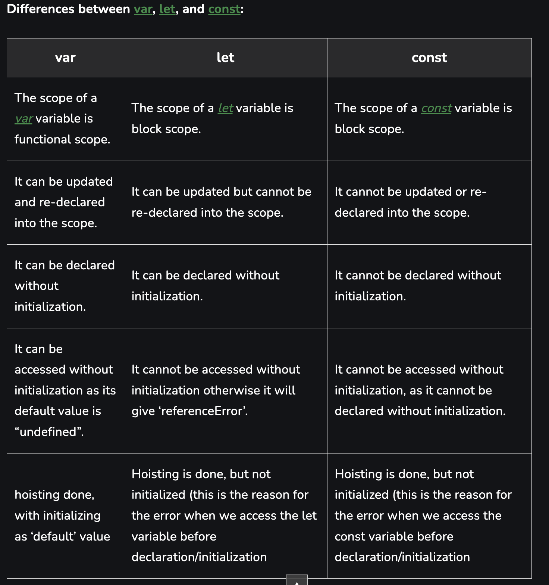

When it comes to variable declaration in JavaScript, there are three keywords you can use: var, let, and const. Here are the differences between them:

## var:

* **Function-scoped**: Variables declared with var are function-scoped. They are accessible within the function in which they are declared.
* **Hoisting**: var variables are hoisted to the top of their scope, which means you can use them before they are declared. However, their value will be undefined.
* **Reassignment and redeclaration**: Variables declared with var can be reassigned and redeclared within the same scope without any restrictions.
* **No block scope**: var variables are not block-scoped, meaning they are accessible outside of their block (e.g., if statement or loop).
## let:

* **Block-scoped**: Variables declared with let are block-scoped, which means they are accessible only within the block in which they are declared.
* **No hoisting**: let variables are not hoisted. You must declare them before using them; otherwise, you'll get a ReferenceError.
* **Reassignment**: let variables can be reassigned within the same scope, allowing you to change their value.
* **No redeclaration**: You cannot redeclare a variable with the same name within the same scope.
## const:

* **Block-scoped**: Variables declared with const are block-scoped, just like let.
* **No hoisting**: const variables are not hoisted, similar to let.
* **Constant value**: const variables are read-only and cannot be reassigned once their value is assigned. However, if the value is an object or array, its properties or elements can be modified.
* **No redeclaration**: You cannot redeclare a variable with the same name within the same scope.
* In general, it is recommended to use let and const over var. let provides better scoping and prevents some common issues related to hoisting and variable redeclaration. const should be used for variables that are not intended to be reassigned. By using let and const, you can write more predictable and maintainable code.

Note: The introduction of let and const in ES6 (ECMAScript 2015) improved JavaScript's handling of variable scoping and made it more similar to other programming languages.

