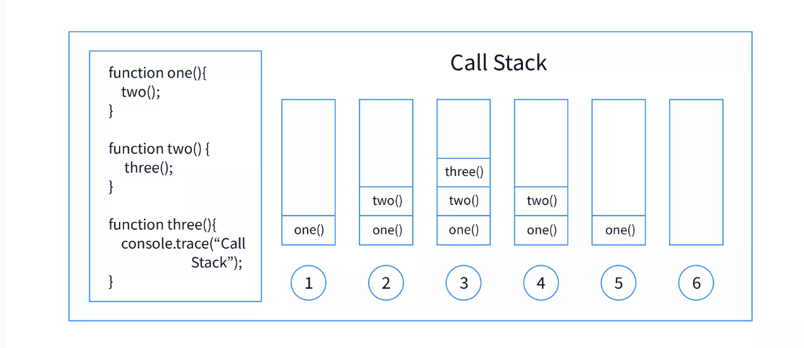
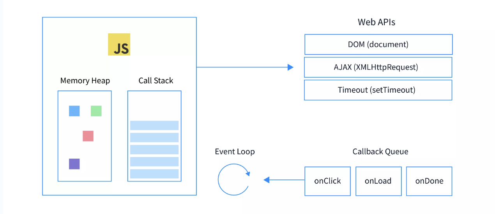

# Event Loop in Node.js

**Introduction to the Event Loop: Overview**
Concurrency is simply doing multiple things at the same time. Just like you are doing different stuff in different tabs while you’re also reading this article.

Imagine you were bound to do only one thing at a time. No Netflix while you eating! Sure, that might help you focus, but you might feel less productive in your day-to-day life. Your resources are getting under utilized. This is precisely the outline of this article. Instead of you, it is javascript we are going to talk about and how event loop in javascript helps to manages it.

## Introduction

Javascript started as a single-threaded synchronous language. A programming language that is supposed to run on a single thread means that this will be able to do only one thing at a time. Doing one thing at a time will require it to follow some execution order. It is thus called synchronous.

In the case of synchronous Javascript, code will be executed line by line. Here’s an example:

```javascript
1. let a = 5;
2. let b = 10;
3. let c = b/a;
4. print(c)

```

Each line is executed one by one. Synchronous code is also called blocking. This is because line 2 can’t be executed until line 1 is not done executing. You might not realize the “blocking” in this example because operations are usually quick.

```javascript
1. let a = 5, b = 10;
2. let result = calculationOverNetwork(a,b)
3. let c = 15, d = 30;
4. let result2 = d/c;
5. print(result2)

```

In the above example, line 2 involves a network call that takes two minutes to complete. While this call is happening, you can’t really go to line 3, even if the computing capacity of your machine has the capability to compute at that time.

This is where the concept of concurrency becomes important in Javascript. Given that the language is single-threaded unlike other languages like Java which can use multiple threads to achieve concurrency, this curious case of concurrency in JS becomes further interesting.

Before we discuss concurrency in detail, let us try to define some fundamental concepts that are closely associated.

## Concurrency Model in Javascript

**Single Threaded:** Javascript is a single-threaded language. This means all applications ever written using Javascript will use only one thread to run. This idea of a single thread is unpopular among the likes of languages like Java and Python, which use Multithreading. (Doing multiple things with more than one thread at once). Single-threaded also means that the order of execution is always one at a time.

**Non-Blocking:** To put it simply, non-blocking means that the execution of the program will not be blocked because of some independent code that takes unusually long to execute. If line one has a slow operation, it should not block line two, which is independent of line 1, from executing.

Note: The concept of non-blocking applies only when two operations are independent of each other. Any succeeding operation which has a dependency on the result of the previous operation should always wait.

**Concurrent:** When multiple operations happen simultaneously, they are called to be concurrent.

**Asynchronous:** Asynchronous means that the code can execute immediately. This is unlike the synchronous code, which blocks the execution of the next lines of code until the current line is in execution. We will dive deeper into the lines to come.

## How Does Code Execute in Javascript?


To maintain the order of what’s currently running, Javascript uses a stack while executing the code. You might already be aware that the executions happen inside execution contexts. If not, think of executions contexts as javascript objects that contain the execution of code. Functions have local executions contexts which are generated when the functions are called and everything else is run on the global execution context.

The execution context of the code currently being executed will be on top of the stack. Once it is done executing, the execution context is popped out of the stack. This data structure is famously known as the call stack.

**Let’s understand with an example:**

```javascript
let sayHello = (name) ⇒ { console.log(`Hello ${name}` };
let sayBye = (name) ⇒{ console.log(`Bye ${name}` } ;
let communicate() = (thingToSay) = {console.log(`${thingsToSay`)};
console.log(”Communication Started”);
sayHello("Harsh");
communicate("This is how code is executed in JS");
sayBye("Harsh");
console.log(”Communication Over”);

```

“Doing things” in Javascript is achieved using a call stack and JS Engine. While JS Engine executes the code, the call stack maintains the order of execution. To begin with, think of call stack as an ordinary stack (the data structure) that holds some objects. At the top of the stack is the object representing the call in current execution, which upon completion/termination will be popped out and the control will be passed to the next call/ execution context.


## Visualisation To Understand The Above Example



Here’s what shall happen during the execution of the above code.
1. A global execution context is created and immediately put on the call stack which was earlier empty. Once the context is in the call stack the JS engine begins executing the code.
2. When the control starts with line 4, it logs “Communication Started” on the console.
3. On line 5, the control finds a function invocation that creates a local execution context, immediately the execution context of sayHello is put on top of the call stack.
4. JS Engine will only execute the code within the context of the top element of the stack, and hence the code inside sayHello begins executing and “Hello Harsh” is printed on the console.
5. Since there is no code to further execute, The context of sayHello is popped out of the stack, and the control moves to the next line.
6. The control finds another function invocation, and the process from 3 to 5 happens for the communication function. As a result, “This is how code is executed in JS” is printed on the console.
7. When control reaches the next line, a similar process follows, and “Bye Harsh” is printed on the console.
8. Now, the control is back with the global execution context, which was only half done executing. The control starts executing from where it left off and “Communication Over” is logged
9. Since there is no code left in the global execution context, that is always popped out of the call stack and call stack is empty.

**But Where is Concurrency?**

Let’s try to understand with a classic example of setTimeout. setTimeout introduces most of the developers to asynchronicity in javascript. It accepts two parameters, a callback function and time in milliseconds.

```javascript
console.log("Start")
setTimeOut(function delayThis(){console.log(”This will be delayed”)}, 5000)
console.log("End")

```

1. Whenever setTimeOut is called, the call stack now contains setTimeOut and waits for the delay to happen before moving on to the next line

2. When setTimeout is called, the function call goes to the top of the call stack but is immediately popped. The next line gets executed immediately (without waiting for the delay) When the code begins executing, the first thing that is logged on the console is “Start”. This is pretty obvious.

When the control comes to the second line, setTimeout is called, and a callback function is registered for future execution.


If you don’t already know, a callback function is a function that is passed to another function as a parameter. Since functions are first class citizens in Javascript, they can be passed or returned from another function.

The control does not wait for the delay to happen. Essentially delay does not mean “a delay in the program” rather, it means “a delay in execution of the callback function”. Both are very different things.

Next up the control immediately moves to the third line, and the execution context associated with calling of setTimeout is destroyed. When this happens, the callback function is still in the memory, just not in that execution context. When it was being registered the callback function is moved to a different memory unit. This memory unit, when dealing with javascript in the browser, is often the browser provider local storage. Note that this memory unit is provided by the browser (for client-side javascript implementations) and is not a part of javascript itself. When the callback is ready for execution (10 seconds have elapsed) for execution, it is moved backed to a data structure, just like all function calls are moved to the call stack for execution. This data structure is also known as the callback queue.

Note: Not all callbacks have same priority. Some callbacks use a special queue known as the micro task queue/Job queue, which has higher priority order than the callback queue. It introduces more interesting concepts like starvation in a queue.

```javascript
1. console.log("Start")
2. asyncNetworkCall()
3. console.log("End")

```

Assume that the asyncNetworkCall is implemented as an asynchronous function. This means while the network call is still in function, the control is able to move to line 3 and log something to the console.




Before we start talking about event loop in javascript. Let’s go back to the building blocks again. There is some javascript code hanging out with your favorite code editor. We know by this point that JS Engine and the call stack are the primary things responsible for running the javascript code. In order for the code to be executed, it has to be brought on the call stack for JS Engine to execute it.

Now recall the callback function in the example above. Last we heard of it was when it was in some fancy new memory unit called the callback queue. After 10 seconds have passed, it has to be executed. Event loop in JavaScript is such a mechanism which handles this. This means it manages the lifecycle of a callback function from the callback queue to the call stack.

Whenever you read about the event loop in javascript next, think of it as a mechanism more than anything else.

## But How does it work?

Let’s begin by stating the universal truth - “A call stack will have to be empty for the event loop to bring anything in it”.

Whenever the call stack is empty, the first entered unit in the callback queue is brought to the call stack by the event loop which was observing both the call stack and callback queue.

## Did You Notice?

setTimeout of an ‘n’ seconds does not guarantee execution exactly when ‘n’ seconds have passed, rather it guarantees a minimum delay of ‘n’. This is because after a defined limit, the callback function moves to the callback queue (stating ready for execution) where the event loop is supposed to pick it for actual execution.

A very interesting piece of information event loop in javascript is an event loop does not block. Operations that might potentially require waiting are performed using callbacks and events.


